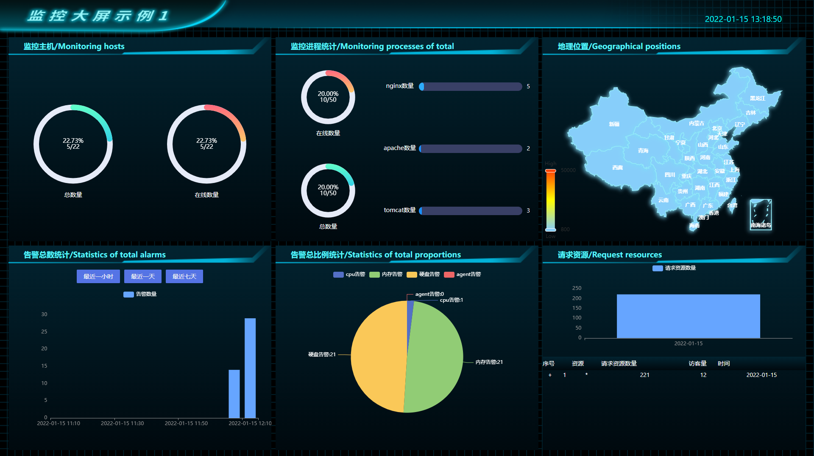
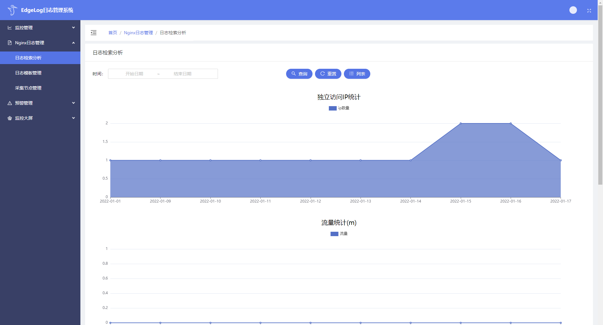
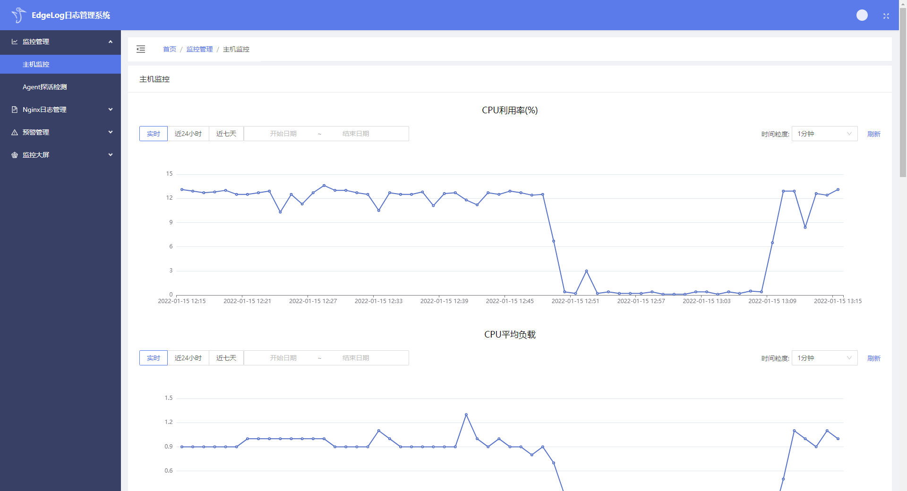

简体中文 | [English](./README.md) | [官网](https://edgelog.devautoops.com) | [文档](https://edgelog.devautoops.com/help/)

# EdgeLog- 轻量级的ELK

EdgeLog是一款轻量级的日志管理系统，基于DevOps理念、完全自研。

企业日常生产中各类应用会产生海量数据，管理每天产生的日志是必不可少的一个环节。当前多选用ELK日志管理套件，ELK能实现企业对日志管理的需求，功能十分强大，但是也存在诸多不便，比如组件所占磁盘空间较大、依赖各种预设的环境，数据查询效率受Elasticsearch可扩展性限制等，这些不便显得ELK比较笨重。而EdgeLog能克服ELK诸多不便，为ELK提供更轻量化的选择，为需要的开发者、企业提供便利。

Edgelog采用Golang开发，主要由客户端应用日志采集组件Agent和服务端管理组件组成，采集数据存储在专用的时序数据库中。基于Go语言和时序数据库的优异特性，EdgeLog具有极好的性能、极方便的使用能力、极简单的可维护性，通用于不同的系统平台，比如Linux、Windows、UOS等，也为DevOps领域的海量数据处理提供了新思路。

EdgeLog轻量、配置灵活，不依赖任何环境限制。基于各个组件优异的性能，查询基于高性能可扩展的TDengine数据库，大大提高了查询效率，经验证千万级数据查询用时在毫秒级。

EdgeLog能很好地支持嵌入式环境，为嵌入式硬件设备能力的扩充提供了扎实基础。对于中大型运管软件向硬件过渡迁移，产品价值提升，提供了方便的参考、工具和基础。

## EdgeLog VS ELK
| 比较项 | EdgeLog | ELK |
| :---: | :---: | :---: |
| 系统占用|主程序采用Go语言开发，存储数据库使用TDengine，整个安装包只有几十M大小，安装运行不依赖其他环境，客户端Agent占用系统资源可以忽略|主程序采用Java语言开发，安装包比较大，并且安装和运行严重依赖外部环境，并且安装包体积大，运行占用系统资源较大|
| 检索性能|检索性能高效，基于缓存和可扩展的时序数据库存储|检索性能高效|
| 存储性能|只要节点机器性能满足，不会产生IO丢失，Agent实时取日志到时序数据库，基本没有延时|读取IO文件，可能会产生日志丢失，Logstash同步日志可能产生延时|
| 功能完备|更轻量级的日志管理系统，可以实现对各种应用日志的搜集和管理|重量级的日志管理系统|
| 嵌入式|支持嵌入式系统的集成，灵活可定制|一个小型的可嵌入JavaScript引擎|
| 可扩展性|支持集群化扩展|支持集群化扩展|
| 容错能力|系统已经考虑企业需求做了日志数据的进一步封装和处理|数据挖掘能力较弱，如果需要满足企业对数据方面的要求，需要对ELK做深度开发|
| 前端操作|有漂亮的操作前台，操作简单清晰，只需要点击鼠标，就可以完成相关节点的添加、日志检索和各种聚合查询|前端操作严重依赖kibana性能，可以完成搜索、聚合功能|

## EdgeLog特点

- [轻量] -EdgeLog是一款小巧且功能干练实用的日志管理系统。采用C/S模式与B/S混合模式，拥有优秀写入速度、可存储容量高，占用资源少，部署维护成本低等特性。其诞生的目的就是为了解决在企业业务中，避免为日志系统投入过多的使用和运维成本；采用简单的设计做日志系统最本质的事情。以系统高效稳定运行、低使用成本及服务运维成本为目标。系统的版块可横向扩展，保证高可用，高性能，高容量。功能设计稳定，网络带宽占用可控，内存占用低。

- [模块化] -EdgeLog由客户端Agent和服务端main程序组成，这两个组件均采用Go语言编写，由nginx充当管理后台Web服务器。各组件配置灵活、简单，占用系统资源较少。

- [更高效查询] -EdgeLog使用TDengine存储实时采集的日志，查询基于高性能可扩展的TDengine，采用经过优化的高效查询sql进行各种聚合计算，计算资源不到通用大数据方案的1/5。

- [海量存储] -EdgeLog采用了专用的时序数据库TDengine来进行海量日志数据存储。TDengine的列式存储和先进的压缩算法，存储空间不到通用数据库的1/10，存储数据默认保存一年，用户可以根据需要配置保存时间，并且基于TDengine高效集群扩展方案，保证数据高可用的同时，也能释放后端存储系统的压力，满足企业特定需求。

- [简单易用] -EdgeLog提供有Web端系统管理入口，后台菜单布局简洁清晰，各个菜单实现功能独立、配置简单，系统配合中央管理大屏，对各种应用数据做聚合图形展示，灵活多变。

- [多平台，兼容国产CPU平台] -支持Linux、Windows等主流操作系统平台，在大力倡导信息技术应用创新、推进信息安全国产化的今天，EdgeLog也能很好地支持国产CPU平台，支持龙芯、华为鲲鹏、兆芯、海光、飞腾、申威等国产CPU。设计的Agent模块有独立的可执行文件和配置文件，配置文件中开启相应的采集模块能够实现对企业应用日志的采集，真正实现配置灵活功能。

- [适应场景广泛且应用可扩展] - EdgeLog对日志采集和管理有自己无与伦比的优势，针对企业各种应用（如Nginx、Apache、Tomcat、MySQL等等）日志， EdgeLog都能根据应用的不同灵活选择对应系统的日志管理模块单元，并且针对不同应用产生的日志，EdgeLog提供了不同的接口，如何管理这些日志，EdgeLog完全按照企业管理员的想法来灵活调用相应的配置单元接口，方便省时，大大提高了企业生产效率。日志采集采用C/S服务模式，管理后台采用B/S模式，Agent日志采集客户端适用于多种操作系统平台，如Linux、Windows、国产麒麟、UOS等。并能通过EdgeLog系统自定义客户需要关注的日志指标，支持从海量的日志中搜索关键字日志信息，及时反馈客户生产系统中应用的工作负载、性能，能够及时预警系统中存在的各种生产安全隐患。并且可以根据企业需求，对企业特殊应用定制相关功能模块，实现灵活可扩展。

想要进一步了解EdgeLog管理系统，您可以访问[EdgeLog](https://edgelog.devautoops.com)的官方网站。

## 优秀DevOps工具标准自检
| 特性 | EdgeLog |
| --- | --- |
| 易集成|很容易和其他组件集成，在嵌入式系统中也能很好实现|
| 强大API支持 | 有丰富的API，且有详细文档说明|
| 跨平台| 支持Linux、Windows等各主流操作系统平台，也广泛支持常用芯片平台 |
| 软件开发自动化|支持软件各个组件的迭代更新和自动分发|
| 可定制|提供开源版本和专业版本，并且针对特定场景提供专业的定制化服务|
| 简单易用|系统功能模块简单易用，各组件有详细的使用帮助指南和丰富的API|
| 仪表盘|默认配有常见参数的精美仪表盘|
| 高性能|客户端和服务端均采用Go语言开发，数据存储基于可扩展的高效查询时序数据库，系统结合了两者的优势优点，整体性能极为强悍|
| 价格|开源版本免费使用|
| 支持CI/CD|基于DevOps理念开发和不断迭代，支持持续集成和持续分发|
| 客户支持|专业团队，丰富的电信、金融类高标准企业服务经验，快速响应|

## 演示地址

体验EdgeLog开源版在线[演示系统](http://demo.edgelog.devautoops.com)。

## 系统截图

## 开源说明

当前Git库中已开源了服务端的源代码，并提供有详细的API文档说明。客户端Agent的源代码请查看[Agent开源库](https://github.com/)。有任何疑问，可在Issues中提出，会尽快回复。
如想在本地安装试用完整的系统，可[下载](https://edgelog.devautoops.com/download/)完整的前后端安装程序。

## API文档

了解系统详细API，可以访问[EdgeLog API](https://edgelog.devautoops.com/help/api.html)。

## 安装、操作与帮助

请遵循[安装文档](https://edgelog.devautoops.com/help/install.html)以安装EdgeLog，有关操作手册及帮助文档，请阅读[文档&帮助](https://edgelog.devautoops.com/help/)。

## 专业支持

我们根据市场和企业需要，不断迭代，也乐意基于场景特殊性提供专业定制服务。如有需要，前往[联系我们](https://edgelog.devautoops.com)。

## Others
EdgeLog系统还包括Agent组件，Agent主要用来采集客户端应用程序日志和与Service组件交互，想要了解Agent组件详情，[点击](https://github.com/DevAutoOps/EdgeLog-Agent)。
